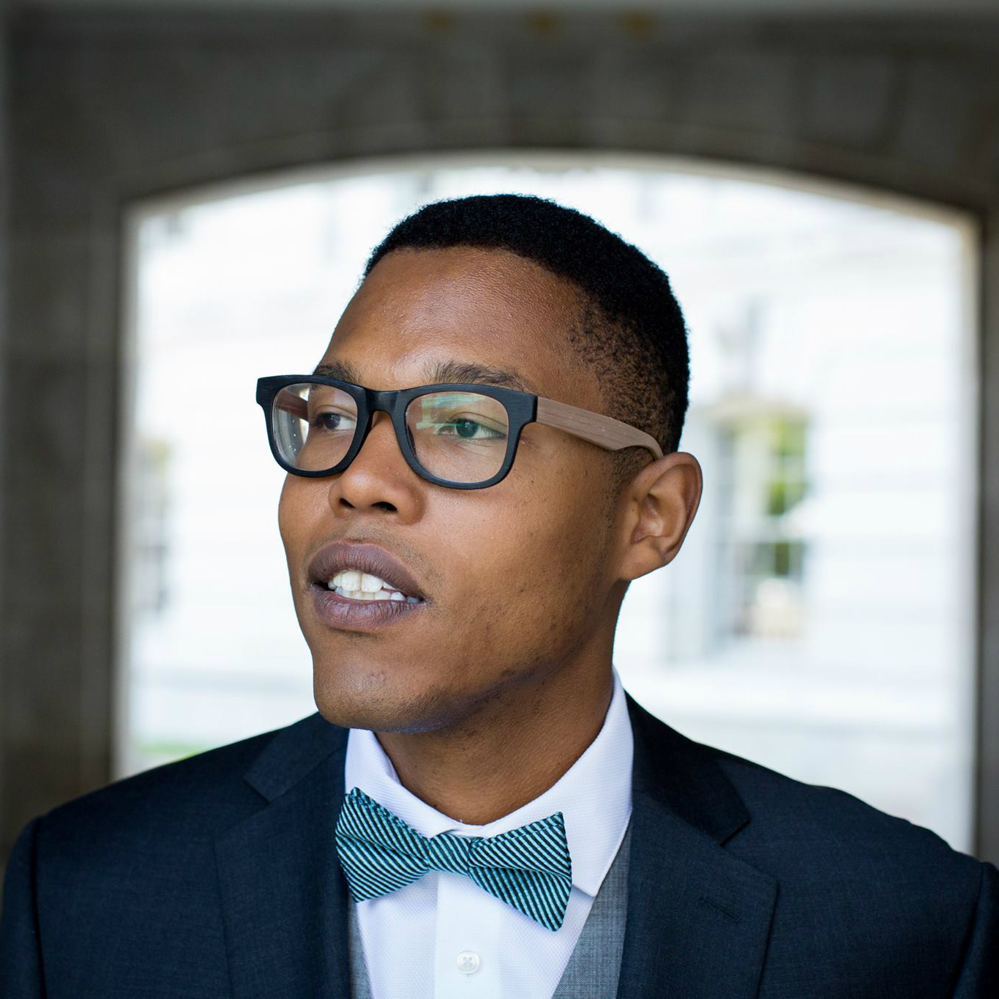

class: inverse, center, middle

# Math and Political Science 

### (Political Science and Math)

<!-- include setup -->

---
class: center, inverse, middle

# Why math?

---

class: center

# In general...

--

Math is explicit and specific

--

*Formalizing:* lay out premises and assumptions, derive implications

--

Discover hidden insights

--

Even if you don't do highly mathematical work, you will encounter it

---

class: center

# For empirical research   (data analysis...) 

--

Principled measurement methods

--

Formally describe patterns in observed data

--

Make judgments about *statistically meaningful* findings (vs. random noise)

--

Make causal inferences

---

class: center

# For formal models   (game theory...)

--

Define sets of actors, preferences, incentives

--

Derive actors' strategies for optimal payoffs

--

Describe trade-offs of certain actions

--

Dealing with limited information, probabilistic beliefs, learning from new information

---

class: inverse, center, middle

# Objectives

---

# Objectives

Operationally...
--

- Preparation for methods courses
- Practicing essential arithmetic routines

--

Conceptually...
--

- Show where political science needs math (using examples)
- Intuitive, conceptual understanding is most important

--

You won't memorize everything we cover this week,

but you need to be able to "roll with it" in class

<!-- -- 1. New: *computing applications and practice* (using R)! -->

---

class: center, middle, inverse

# Reassurances

---

# Reassurances

Some material will be unfamiliar (and maybe scary) at first, *but*...

--

- Nobody expects you to be an expert by the end of math camp (that isn't the point)

--

- The point is intuition and application, not proofs or overly tricky examples

--

How do I know you will be fine? 

--

- I had a weak math background (never took calculus until grad school)

--

- I skipped math camp (was out of town)

--

- Different areas of research emphasize different areas of math (and specialization is the norm)

--

- You get out what you put in

---

class: center, middle

# Questions so far?

---

class: center, middle, inverse

# Agenda

---

### Mornings (9–12ish): math lessons

Lecture slides, definitions, examples

--

### Afternoons (1–3ish): practice

Take-home exercises will be distributed

Instructors will be present to work through problems

--

### Happy Hour (3ish--6ish)

--

Just kidding

--

#### Contact your instructors at any time 

(But you should feel free to ask questions throughout)

---

#### Monday: Essential algebra and pre-calculus (Mike)

- Fundamentals, notation, functions

--

#### Tuesday: Linear algebra (Micah)

- Vectors and matrices
- Useful for manipulating real data

--

#### Wednesday: Calculus (Micah)

- Limits, derivatives, integrals
- How variables affect other variables

--

#### Thursday: Finish calculus, Probability (Micah/Mike)

- Mathematical intuitions of independent and conditional probability
- Probabilistic processes (random variables), patterns in "real data"

--

#### Friday: Finish probability, Maybe computer fun (Mike/Micah?)

- Potentially: fundamentals of data in the computer (using R)

---

class: center, middle

# Deliverables?

Daily exercises (not collected)

No final exam (or grades of any kind)

You are in charge of yourselves

### Questions?

---

# In the classroom

--

- Covering lots of ground

--

- Everyone has a different background

--

- Please ask questions

--

- Open and accepting environment

--

### Let us (Micah and me) know how we can make this work better

--
- Ask lots of questions! They help the entire class!

- Slow us down

- Ask *why* we are learning something

---

# Resources

The [Github repository](https://github.com/mikedecr/math-camp-2018): 

- Slides, exercises
- Source code to build it all

Other resources:

- View [last year's materials](https://github.com/mikedecr/math-camp-2017)
- Gill, [*Essential Mathematics for Political and Social Research*](https://www.amazon.com/Essential-Mathematics-Political-Research-Analytical/dp/052168403X)
- Moore & Siegal: [*A Mathematics Course for Political & Social Research*](http://people.duke.edu/~das76/MooSieBook.html)

---

class: center, middle, inverse

# About your instructors

---

# Mike DeCrescenzo

.pull-left[]

.pull-right[
Roots in St. Louis and Kansas City, Missouri. Short stints in Berkeley, CA

Studies American politics & political methodology (since 2014)

Primary elections, gender and voting, voter identification requirements

Comparative advantage: Bayesian analysis (probability and statistics)

Email: [decrescenzo@wisc.edu](mailto:decrescenzo@wisc.edu)
]

---

# Micah Dillard

.pull-left[]

.pull-right[
A proud Ohio son (Columbus)

Studies international relations & political methodology (since 2014)

Economic sanctions, energy and foreign policy, non-traditional security

Comparative advantage: Formal theory (algebra and calculus)

Email: [micah.dillard@wisc.edu](mailto:micah.dillard@wisc.edu)]

---

class: center, middle, inverse

# Let's get started

