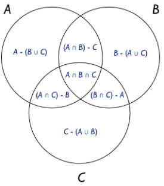

class: center, middle

# Welcome


<!-- include setup -->

```{r xaringan-themer, include = FALSE}
library("here")
source(here("R/setup-lectures.R"))
```

---

class: inverse, center, middle

### First...

## Numbers


---

## Math: not just numbers

Math is a general framework for manipulating various concepts, *one of which* is "numbers"

Types of numbers:

- Integers (whole numbers, including negative): $\mathbb{Z}$
- Real numbers (the continuous number line): $\mathbb{R}$
- Positive and negative real numbers: $\mathbb{R}^{+}$ and $\mathbb{R}^{-}$
- Real numbers in $n$ dimensions: $\mathbb{R}^{n}$
- Complex numbers: $\mathbb{C}$
  + $1 + 2i$
  + where $i = \sqrt{-1}$


---

## Special numbers

$0$ and $1$: 
--

- useful for identities in addition and multiplication
  
  + $4 + 0 = 4$
  
  + $1 * x = x$

--

- Useful for turning "off" and "on" pieces of an equation

  + We have an equation: $4 + z(5x) + (1 - z)3x$ 

--

  + What happens if $z = 0$? 

--

  + If $z = 1$?


---

## Special numbers

$\pi$: Approximately $3.1415926$ ... 

- Ratio of a circle's circumference to its diameter
- Useful for angles, circles, polar coordinates (which you may use!)

--

$e$: Euler's number

- Approximately $2.718281828$ ... 
- Derivative of $e^{x}$ is equal to $e^{x}$
- *Very* important for probability and statistics

--

$i$: The imaginary number, $\sqrt{-1}$. For advanced algebra

--

$\infty$: Infinity. Not really a number but a boundless quantity


---

## Numbers and variables

We can manipulate numbers with simple operations

--

- addition: $1 + 2$

--

- subtraction: $3 - 4$

--

- multiplication: $5 \times 6$

--

- division: $7 \div 8$

--

We can *generalize* these statements by using *variables*

- $1 + x$
- $3 - y$
- $5 \times a$
- $7 \div m$

*Variable*: a symbol to represent an entity that could take different values


---

class: middle, center

### With me so far?


---

class: inverse, center, middle

# Equations

Statements about equality and inequality

---

## Equations

Equality: left-hand and right-hand sides (LHS and RHS) are substitutable.

If $a = 7x$, then $8*a$ and $8 * 7x$ are equivalent statements

--

- Usually used to find *new ways to express a known idea* or to *derive implications from known ideas*


--

*Inequalities* show whether LHS or RHS is greater

- Usually we use them to find the *conditions under which a statement holds*


---

## Solving equalities and inequalities

Isolate an unknown quantity to express it in terms of known quantities

--

Solve for $x$: 

$$-7x + 3 = 12$$

--

Solve for $x$: 

$$-7x + 3 > 12$$

--

Remember to flip an inequality if you multiply by a negative number!


---

class: inverse, center, middle

# Data


---

## Data

The information we record about what we study

- **Cases:** The units being studied (rows)
- **Variables:** Characteristics that describe units (columns)
- **Values:** Specific realization of a variable (cells)

| Establishment     | Location      | Coffee | Vibe | Notable Flaw |
|:------------------|:--------------|-------:|:-----|:-------------|
| Aldo's            | Campus        | 7      | good | no plugs 
| Ancora            | Capitol       | 8      | great | hours 
| Barriques         | Capitol       | 6      | good | bathroom key 
| Colectivo         | State St.     | 7      | fair | spotty wifi 
| Fair Trade        | State St.     | 8      | good | expensive, tables 
| Michelangelo's    | Capitol       | 5      | meh | bathroom key 
| Steep & Brew      | Bascom Hill   | 1      | fair | truly the worst coffee ever 


---

## Classifying data

Quantitative vs. Qualitative *analysis*

- Broad, sometimes contentious, arguably artificial divides in the study of politics
- Quantitative: larger $n$, statistical description and inference
- Qualitative: smaller $n$, rich description, non-statistical inference

Quantitative vs. Qualitative *variables*

- Quantitative: countable, numeric (age, number of toes)
- Qualitative: not countable but descriptive (gender, party preference)
- Unlike qualitative *research*, qualitative variables can still be organized in a data table

I advise not getting too hung up these classification systems. Use them only until you can lose them


---

## Discrete vs. Continuous 

Discrete

- Variables take specific values from a finite set of possible values
- Could be categories, could be discrete numbers
- Level of the atmosphere, number of parties, country of origin

Dichotomous

- Special type of discrete variable, two possible values
- 0 or 1, yes or no, war or peace, win or lose, voted or not

Continuous

- Variables take values from a continuous number line
- Could be a bounded number line
- GDP, vote share, percentage of turnout, unemployment rate


---

## Related: the "levels of measurement"

Nominal / Categorical

- *Unordered* categories
- e.g. party affiliation, gender, country of origin, occupation

Ordinal

- *Ordered* or *ranked* outcomes
- Could be categories, but numbers are possible (e.g. rankings)
- No fixed "distance" between levels
- e.g. highest level of educational attainment, levels of democratization, issue prioritization


---

## Related: the "levels of measurement"

Interval

- Ordered values with *fixed distance between levels*
- But *no true zero point*
- Issue scales, day of the year, Likert scales (debatable)

Ratio:

- Ordered, fixed intervals, *and true zero*
- Vote percentage, turnout, minutes in line to vote


---

## Why do these categorizations matter?

Different types of variables lend themselves to different types of analysis

--

- Types of statistics you calculate 

--

- Possibilities for data visualization

--

- Statistical models (You will learn if you take 812, 813, MLE, etc.)

--

  + **Discrete/Nominal**: logistic regression (logit), multinomial logit, $\chi^{2}$ (chi-square)
  
--

  + **Ordinal**: Ordinal logit, also $\chi^{2}$
  
--

  + **Interval**: least-squares regression
  
--

  + **Ratio**: least-squares, count/rate models, duration/survival models


---

class: center, middle

### Do you buy that?


---

class: inverse, center, middle

# Sets

(useful for "speaking math" about data)


---

## Sets

Collections of objects or entities

--

Sets contain "elements" or "members"

- if $o$ is in set $A$, then we write $o \in A$ 
- $o$ "is an element of" $A$

--


Sets could contain individual numbers, but they could contain other sorts of entities

- vectors, matrices
- functions, probability distributions (which are...?)


---

class: center, middle

### We need *only some* set notation to help us work with data


---

## What's in a set?

A set could contain individual elements, written as 

$A = \{1, 2, 3, 4, 5, 6, 7, 8, 9, 10\}$

--

A set could contain intervals

- $B = [1, 10]$ (square brackets imply that endpoints are included)
--

- Is it the case that $A = B$?
--

- $C = (0, 11)$ (parentheses indicate that endpoints are not included)
- Does $B = C$?


---

## Set notation

$\cup$: the *union* of two sets

- elements that are members of either set
- if $A = \{1, 2\}$ and $B = \{2, 3\}$, then $A \cup B = \{1, 2, 3\}$

--

$\cap$: the *intersection* of two sets

- elements that are members of both sets
- if $A = \{1, 2\}$ and $B = \{2, 3\}$, then $A \cap B = \{2\}$

--

(interestingly enough, these concepts are helpful for probabilities)

--

$\emptyset$: the empty set (null set) 


---

class: center, middle



.footnote[
https://bosker.wordpress.com/2013/07/10/venn-diagram-partitioning/
]


---

## Symbols and Set Notation

A handful of symbols are commonly used when we represent data mathematically.

| Symbol    | Meaning                                     |
| :-        | :-                                          |
| $>$       | greater than
| $\geq$    | greater than or equal to
| $<$       | (less than)
| $\leq$    | less than or equal to
| $\approx$ | approximately equal to $(x \approx y)$
| $\equiv$  | equivalent to (for establishing identities)
| $\propto$ | proportional to $(4x \propto x)$


---

## Symbols and Set Notation

| Symbol            | Meaning                                              |
| :-                | :-                                                   |
| $\neg$            | not
| $/$               | not (if through a symbol)
| $\mid$            | given that $(A \mid B)$
| $\in$             | is an element of a set $(x_{i} \in \mathbf{x})$
| $\to$             | implies $(A \to B)$
| $\leftrightarrow$ | if and only if ( $[x = y] \leftrightarrow [y = x]$ )


---

##  Subsets

if $A = \{1, 2\}$ and $B = \{1, 2, 3\}$:
--

- $A \subseteq B$ means "A is a subset of B"
--

- Can $A$ be a subset of $A$?
--

- using $\subseteq$, yes it can

--

"Proper subset"
--

- $A \subset B$
- $A$ isn't a proper subset of $A$
- proper subsets can't be equivalent to their superset


---

## Indexing

Variables can be sets, and they can take different values for different individuals in a dataset. It is convenient to *index* individual observations using a subscript (typically $i$). 

| Student | Math Courses in College |
|--------:|------------------------:|
| 1       | 3
| 2       | 0
| 3       | 1
| 4       | 4

If $x$ represents the number of math courses, $x_{i}$ refers to the $i$th observation in $x$

- $x_{1} = 3$
- $x_{2} = 0$
- $x_{3} = ?$
- $x_{4} = ?$


---

class: center, middle

## Set practice


---

## Consider the following sets

$A = \{10, 20, 30\}$

$B = [1, 10]$

$C = (0, 40)$

--
- what is $A \cap B$?

--

- is $B \subseteq C$?

--

- is $A_{2} \in B$

--

- Which elements in $A$ are subsets of $B$? Subsets of $C$?

--

- is $(A \cup C) \subset C$?


---

## Set notation in the wild

Almost verbatim from a paper about congressional votes ("roll call votes")<sup>*<sup>
- The data consist of $n$ legislators voting on $m$ different roll calls [bills].
- Each roll call $j = 1, \ldots , m$ presents legislators $i =1,\ldots,n$ with a choice between a 'Yea' position $\zeta_{j}$ and a 'Nay' position $\Psi_{j}$, locations in $\mathbb{R}$
- Let $y_{ij} = 1$ if legislator $i$ votes Yea on the $j$th roll call and $y_{ij} = 0$ otherwise.

| Legislator ( $i$ ) | Bill ( $j$ ) | Vote ( $y$ )
| ----:              | -----:       | ---:         |
| 1                  | 1            | 0
| 1                  | 2            | 1
| $\vdots$           | $\vdots$     | $\vdots$
| $n$                | $m$          | $y_{nm}$ |

.footnote[
\* \- Clinton, Jackman, and Rivers. "The Statistical Analysis of Roll Call Data." *APSR* 2004
]


---

class: inverse, center, middle

# Functions


---

## Functions

Operations or rules of assignment that map an input to a *unique* (that is, exactly one) output

--

- inputs: also called arguments
- outputs: also called values
- mapping: also called the *definition*
--

- $\mathrm{value} = f(\mathrm{argument})$
- $f = \text{[insert definition]}$

--

Analogies include:

- algorithms, machines, black box, routinized process


---

## Functions

We can generically refer to functions using $f(x)$ or $g(x)$, just as we might use variables to stand in for values.

--

- e.g. let $f(p) = \log\left(\frac{p}{1 - p}\right)$
--

- $f(0.5) = ?$

--

Other symbols also are fine, e.g.

- $\Phi\left( \cdot \right)$
- $\Gamma(\cdot)$
- $B(\cdot)$
- $\Lambda(\cdot)$


---

## Operators

*Operators* are components of a function that tell what to do with the inputs to produce the outputs

Several common operators serve as the building blocks of mathematical functions

- $+$
- $-$
- $\times$
- $/$

--

Order of operations:

- operations within parentheses
- Exponents
- Multiplication and division (right to left)
- Addition and subtraction (right to left)


---

## Function examples

| $x$ | $y$ | $z$ || $f(x,y) = x - y$  || $g(z) = 2z - 1$ || $h(x,y,z) = \displaystyle\frac{x+y}{z}$ |
|---|---|---||:--:||:---:||:--:|
| 5 | 0 | 5 || 
| 2 | 5 | 8 || 
| 0 | 3 | 9 || 
| 3 | 2 | 0 || 
| 8 | 4 | 2 || 
| 1 | 2 | 4 || 


---

## Function examples

| $x$ | $y$ | $z$ || $f(x,y) = x - y$  || $g(z) = 2z - 1$ || $h(x,y,z) = \displaystyle\frac{x+y}{z}$ |
|---|---|---||:--:||:---:||:--:|
| 5 | 0 | 5 || 5                 || 9               || 1    |
| 2 | 5 | 8 || -3                || 15              || .875 |
| 0 | 3 | 9 || -3                || 17              || .333 |
| 3 | 2 | 0 || 1                 || -1              || *undefined*  |
| 8 | 4 | 2 || 4                 || 3               || 6    |
| 1 | 2 | 4 || -1                || 7               || .75


---

## Nested functions

Given that all functions do is map an input to an output, we can nest functions


- Imagine we perform one function $f(\cdot)$
- Output from $f(\cdot)$ serves as the input for $g(\cdot)$
- $g(f(\cdot))$

--

Functions are evaluated "inside out" following the order of operations

--

Suppose $x = 3$, $f(x) = 2x + 5$, $g(x) = x - 7$

--

$$f(g(x)) = ?$$

--

$$g(f(x)) = ?$$


---

## Piecewise-defined functions

A *piecewise-defined function* has different definitions for different regions of the domain (domain = function inputs)

--

.pull-left[
$$f(x)=\left\{\begin{array}{ll} 0 & \text{if } x < 0 \\ x & \text{if } x \in [0, 1] \\ x^{2} & \text{if } x > 1 \end{array}\right.$$

```{r piecewise_1, fig.width = 3, fig.height = 3}

pw1 <- 
  data_frame(x = seq(-3, 3, .01), 
             y = case_when(x < 0 ~ 0, 
                           x >= 0 & x <= 1 ~ x, 
                           x > 1 ~ x^2))

ggplot(pw1, aes(x = x, y = y)) +
    geom_hline(yintercept = 0, color = lgray) +
    geom_vline(xintercept = 0, color = lgray) +
    geom_line(size = 1) +
    NULL

```

]

--

.pull-left[
$$g(x)=\left\{\begin{array}{ll} x+3 & \text{if } x \in (-\infty,0)\\ 4   & \text{if } x = 0  \\ x-3 & \text{if } x \in (0,\infty) \end{array}\right.$$

```{r piecewise_2, fig.width = 3, fig.height = 3}

pw2 <- 
  data_frame(x = seq(-3, 3, .01), 
             y = case_when(x < 0 ~ x + 3, 
                           x == 0 ~ 4, 
                           x > 0 ~ x - 3))

ggplot(data = pw2, aes(x = x, y = y)) + 
    geom_hline(yintercept = 0, color = lgray) +
    geom_vline(xintercept = 0, color = lgray) +
    geom_line(size = 1, data = filter(pw2, x < 0)) +
    geom_point(data = data_frame(x = 0, y = 3), shape = 21, fill = "white", size = 3) +
    geom_point(data = filter(pw2, x == 0), size = 3) +
    geom_line(size = 1, data = filter(pw2, x > 0)) +
    geom_point(data = data_frame(x = 0, y = -3), shape = 21, fill = "white", size = 3) +
    NULL

```
]


---

class: center, middle

### Function practice


---

##  Practice

Sketch graphs of the following functions:

- $p(x) = 2x - 1$, on the interval $[-2, 2]$

- $q(x) = x * -1^{x}$, for integers $\{0, 1, 2, 3, 4, 5\}$

- $r(x) = 2x^{2} - 3x + 4$, on the interval $(0, 4)$


---

class: middle, center


$p(x) = 2x - 1$, on the interval $[-2, 2]$ 

```{r fun_practice_1, fig.width = 5, fig.height = 5}

px <- data_frame(x = seq(-2, 2, .01),
                 px = (2 * x) - 1)

ggplot(px, aes(x = x, y = px)) + 
  geom_hline(yintercept = 0, color = lgray) +
  geom_vline(xintercept = 0, color = lgray) +
  geom_line(size = 1) +
  NULL

```


---

class: middle, center

$q(x) = x * -1^{x}$, for integers $\{0, 1, 2, 3, 4, 5\}$

```{r fun_practice_2, fig.width = 5, fig.height = 5}

qx <- data_frame(x = 0:5,
                 qx = x * ((-1)^(x)))

ggplot(qx, aes(x = x, y = qx)) + 
  geom_hline(yintercept = 0, color = lgray) +
  geom_vline(xintercept = 0, color = lgray) +
  geom_point(size = 3) +
  scale_y_continuous(breaks = seq(-4, 4, 2)) +
  NULL

```


---

class: center, middle

$r(x) = 2x^{2} - 3x + 4$, on the interval $(0, 4)$

```{r fun_practice_3, fig.width = 5, fig.height = 5}

rx <- data_frame(x = seq(0, 4, .01),
                 rx = (2 * (x^2)) + (3 * x) + 4)

ggplot(rx, aes(x = x, y = rx)) + 
  geom_hline(yintercept = 0, color = lgray) +
  geom_vline(xintercept = 0, color = lgray) +
  geom_line(size = 1) +
  geom_point(data = filter(rx, x %in% c(0, 4)),
             shape = 21, fill = "white", size = 3) +
  NULL

```


---

class: inverse, center, middle

### Important functions, routines, and properties


---

## Limits

*Limits* will help us formally define concepts in this lecture.

A *limit* describes a function's behavior at a given input: $\displaystyle\lim_{x \to 0}\left( 2 - x^{2} \right) = 2$

...or as the input value changes: $\displaystyle\lim_{x \to \infty}\left( 2 - x^{2} \right) = -\infty$


```{r limit_example, fig.height = 3, fig.width = 4}

limex <- data_frame(x = seq(-2, 2, .01),
                    y = 2 - (x^2))

ggplot(limex, aes(x, y)) + 
  coord_cartesian(ylim = c(-2, 3)) +
  geom_hline(yintercept = 0, color = lgray) +
  geom_vline(xintercept = 0, color = lgray) +
  geom_hline(yintercept = max(limex$y), linetype = "dotted") +
  geom_point(aes(x = 0, y = 2)) +
  geom_line()

```


---

## Continuity

A function is *continuous* if it has no gaps or jumps. 

$$\lim\limits_{x \to a} f(x) = f(a)$$

Meaning... small changes in input produce small changes in output

```{r continuity, fig.width = 7, fig.height = 3.5}

cont <- 
  data_frame(x = seq(0, 5, .01),
             Continuous = x^(1/2),
             Discontinuous = ceiling(x) + x) %>%
  gather(key = type, value = y, -x) %>%
  mutate(group = case_when(type == "Discontinuous" ~ ceiling(x)),
         point = case_when(x == group ~ y),
         empty = point + 1) %>%
  arrange(group) 

ggplot(cont, aes(x = x, y = y)) +
  geom_line(aes(group = group)) +
  geom_point(aes(y = point), shape = 16) +
  geom_point(aes(y = empty), shape = 21, fill = "white") +
  facet_wrap(~ type, scales = "free") +
  theme(axis.text = element_blank())

```


---

class: center, middle

## In the wild

---

## In the wild: Continuity and Discontinuity

Why we care about continuity

--

- Differentiation (derivatives), which is good for...

--

- Utility functions (game theory)

--

- How some variable affects another variable (statistical models)

--

- More on Wednesday


---

## Continuity and Discontinuity

Why we care about discontinuity: *regression discontinuity*

--

- causal inference method: units are "treated" if above/below a threshold
--

- Popular example: vote share to wins and losses, wins and losses affect future fundraising

```{r rdd_data}

set.seed(321)
rd <- data_frame(x = rnorm(200, sd = 0.01)) %>%
  mutate(y = case_when(x > 0 ~ 1.5 + rnorm(nrow(.)), 
                       x < 0 ~ rnorm(nrow(.)))) %>%
  filter(abs(x) < 3)

```


--

.pull-left[

```{r rdd_1, fig.width = 4, fig.height = 3}

ggplot(rd, aes(x = x, y = y)) +
  geom_point(shape = 1, size = 0.5) +
  labs(x = "Party vote margin\n(previous cycle)", y = "Campaign fundraising\n(current cycle)") +
  coord_cartesian(ylim = c(-4, 6)) +
  scale_x_continuous(labels = scales::percent) +
  theme(axis.text.y = element_blank())

```

]

--

.pull-right[

```{r rdd_2, fig.width = 4, fig.height = 3}

ggplot(rd, aes(x = x, y = y)) +
  geom_vline(xintercept = 0) +
  geom_point(shape = 1, size = 0.5, color = mgray) +
  geom_smooth(aes(group = x > 0), show.legend = FALSE, color = dgray) +
  labs(x = "Party vote margin\n(previous cycle)", y = "Campaign fundraising\n(current cycle)") +
  annotate("text", x = -.015, y = 5, 
           label = "Threshold determines\ntreatment assignment") +
  annotate("text", x = .015, y = -3.5, 
           label = "Party won\nprevious election") +
  annotate("text", x = -.015, y = -3.5, 
           label = "Party lost\nprevious election") +
  geom_segment(x = -.015, xend = -.001, y = 3.8, yend = 2.5, color = mgray) +
  coord_cartesian(ylim = c(-4, 6)) +
  scale_x_continuous(labels = scales::percent) +
  theme(axis.text.y = element_blank())

```

]


---

## Monotonicity

A function is *monotonic* if it always increases (monotonically increasing) or always decreases (monotonically decreasing)

- increasing: for any $x_{1} > x_{2}$, then $f(x_{1}) > f(x_{2})$
- decreasing: for any $x_{1} < x_{2}$, then $f(x_{1}) < f(x_{2})$

```{r monotonic, fig.width = 6, fig.height = 3}

mono <- 
  data_frame(x = seq(0, 5, .01),
             m1 = 2 * x,
             m2 = log(x),
             nm1 = -2 * sin(x),
             nm2 = -2 + log(x) - (2 * x)) %>%
  gather(key = f, value = y, -x) %>%
  mutate(type = case_when(str_detect(f, "n") ~ "Non-Monotonic", 
                          TRUE ~ "Monotonic"))

ggplot(mono, aes(x, y)) +
  geom_line(aes(group = f)) +
  facet_wrap(~ type, scales = "free") +
  theme(axis.text = element_blank()) +
  NULL

```


---

## Concavity and Convexity

Imagine you draw a line between two points along a function. A function (or segment of a function) is *concave* if this line is below the function, and *convex* if the line is above the function.

- concave: $\frac{f(x_{1}) + f(x_{2})}{2} < f\left( \frac{x_{1} + x_{2}}{2} \right)$

- convex: $\frac{f(x_{1}) + f(x_{2})}{2} > f\left( \frac{x_{1} + x_{2}}{2} \right)$

```{r concavity, fig.width = 6, fig.height = 3}

cc <- data_frame(x = seq(0, 4, .01),
                 concave = log(x) - x,
                 convex = -1 * log(x) + x) %>%
  gather(key = type, value = y, -x)

ggplot(data = cc, aes(x, y)) +
  geom_line(aes(group = type)) +
  facet_wrap(~ type, scales = "free") +
  geom_point(data = filter(cc, x %in% c(0.1, 3))) +
  geom_line(data = filter(cc, x %in% c(0.1, 3)),
            linetype = "dashed")

```


---

# Invertible functions

A function maps an input to an output. A function is *invertible* if there exists a reverse function that maps the output back to the input.

Formally: if $y = f(x)$, then $f^{-1}(y) = x$

Also: $f^{-1}\left( f(x) \right) = x$

```{r inverse, fig.width = 6, fig.height = 3}

invert <- data_frame(x = seq(-3, 3, .01),
                     Invertible = exp(x),
                     `Non-Invertible` = abs(x)) %>%
  gather(key = type, value = y, -x)

ggplot(data = invert, aes(x, y)) +
  geom_line() +
  facet_wrap(~ type, scales = "free") +
  theme(axis.text = element_blank())

```


---

## Exponents

The *exponent* operator multiplies a number by itself the number of times indicated in the exponent

$$x^n = x * x * ... * x \quad (n \text{ times})$$

```{r exponents, fig.width = 10, fig.height = 4}

exps <- 
  expand.grid(x = seq(-4, 4, .01), 
              k = c(1, 2, 3, 8)) %>%
  mutate(fx = x^k,
         klabel = str_glue("x^{k}")) 

ggplot(exps, aes(x = x, y = fx)) +
  geom_hline(yintercept = 0, color = lgray) + 
  geom_vline(xintercept = 0, color = lgray) +
  geom_line() +
  facet_wrap(~ klabel, nrow = 1, labeller = label_parsed) +
  coord_cartesian(xlim = c(-2, 2),
                  ylim = c(-5, 5)) +
  labs(y = "f(x)")

```


---

## Roots

*Root* operators return the number that, when multiplied by itself the number of times indicated in the root, is equal to the input.  When no number is given, that indicates the *square root*.


$$x = \sqrt[n]{x} * \sqrt[n]{x}... \sqrt[n]{x} \quad (n \text{ times})$$


```{r root, fig.width = 6, fig.height = 3}

roots <- 
  expand.grid(x = seq(-4, 4, .01), 
              k = c(2, 3, 8)) %>%
  as_data_frame() %>%
  mutate(fx = case_when(k %% 2 == 0 ~ x^(1 / k),
                        k %% 2 != 0 ~ sign(x) * abs(x)^(1 / k)),
         negfx = case_when(k %% 2 == 0 ~ -1 * fx),
         klabel = str_glue("x^(1 / {k})")) %>%
  gather(key = posneg, value = fx, fx, negfx)


ggplot(roots, aes(x = x, y = fx)) +
  geom_hline(yintercept = 0, color = lgray) + 
  geom_vline(xintercept = 0, color = lgray) +
  geom_line(aes(linetype = posneg, color = posneg), show.legend = FALSE) +
  facet_wrap(~ klabel, nrow = 1, labeller = label_parsed) +
  coord_cartesian(xlim = c(-2, 2), ylim = c(-3, 3)) +
  labs(y = "f(x)") +
  scale_color_manual(values = c(dgray, mgray))

```


---

## Exponents and Roots

All roots can be expressed as exponents (with the same properties)

$$\sqrt[n]{x} \equiv x^{\frac{1}{n}}$$

Important properties for exponents and roots 

|   |   |
|---|---|
| Zeroth power   | $x^{0} = 1$   |
| Negative powers   | $x^{-n} = \frac{1}{x^{n}}$  |
| Inversion using exponents | $x^{-1} = \frac{1}{x}$ | 
| Distribution of powers (multiplication)   | $(x*y)^n = x^n * y^n$   |
| Distribution of powers (division) | $(\frac{x}{y})^n = \frac{x^n}{y^n}$ | 
| Product of powers | $x^n * x^m = x^{n+m}$ | 
| Nested powers | $(x^n)^m = x^{n*m}$ | 


---

class: center, middle

## Two important continuous, monotonic, invertible functions: <br> Exponentials and Logarithms


---

## Exponentials and Logarithms


The *logarithm* (log) of some value $y$ (with base $b$) is...

...the *power* to which that base would need to be raised to equal $y$

$$\text{If } b^{x} = y\text{, then} \log_{b}(y) = x$$

Exponentials and logarithms are inverse functions. Logs "undo" exponentials, and exponentials "undo" logs.


---

## Exponentials and Logarithms

We can see this because exponentials and logs are *reflections of each other* over $y = x$ (one way to identify inverse functions)

```{r explog, fig.width = 4, fig.height = 4}

logexp <- data_frame(x = seq(-5, 5, .01),
                     `e^x` = exp(x),
                     `log(x)` = log(x)) %>%
  gather(key = type, value = y, -x)

ggplot(data = logexp, aes(x, y)) +
  geom_hline(yintercept = 0, color = lgray) +
  geom_vline(xintercept = 0, color = lgray) +
  geom_line(aes(group = type)) +
  coord_cartesian(xlim = c(-3, 3), ylim = c(-3, 3)) +
  geom_abline(linetype = "dashed", color = mgray) +
  annotate("text", x = -2, y = 0.5, label = "b^x", parse = TRUE) +
  annotate("text", x = 2, y = -0.5, label = "log(x)", parse = TRUE)

```


---

## Exponents $\neq$ Exponentials

Exponent: $x^2$ ( $x$ is the base)

Exponentials: $2^{x}$ ( $x$ is the power)

```{r exp_exp, fig.height = 3, fig.width = 7}

data_frame(x = seq(-3, 3, .01),
           Exponent = x^2,
           Exponential = exp(x)) %>%
  gather(key = type, value = y, -x) %>%
  ggplot(aes(x = x, y = y)) +
    geom_line() +
    facet_wrap(~ type, scales = "free")

```

---

## Better yet...

What happens when you exponentiate a parabola? 

$$f(x) = e^{-x^{2}}$$

--

```{r exponentiated_parabola, fig.height = 4, fig.width = 6}

data_frame(x = seq(-3, 3, .01),
           par = x^2,
           `f(x)` = exp(-par)) %>%
  ggplot(aes(x = x, y = `f(x)`)) +
    geom_line()

```


---

## Rules for logarithms

The following apply to all logs, regardless of base

| | |
|-|-|
| Log 1 | $\log(1) = 0$ |
| Log 0 | undefined, approaches $-\infty$ |
| Multiplication | $\log(x * y) = \log(x) + \log(y)$ |
| Division | $\log(\frac{x}{y}) = \log(x) - \log(y)$ | 
| Exponentiation | $\log(x^{a}) = a * \log(x)$ | 
| Basis | $\log_{b}(b^{x}) = x$ | 

(potentially) helpful video for understanding logs [here](https://www.youtube.com/watch?v=N-7tcTIrers)


---

class: center, middle

## You *WILL* use logs and exponents


---

### They are important for *probability distributions*

$$\displaystyle f(x \mid \mu, \sigma) = \frac{1}{2\pi\sigma^{2}}e^{- \frac{(x - \mu)^{2}}{2\sigma^{2}}}$$


```{r normal_pdf, fig.width = 5, fig.height = 4}

data_frame(x = seq(-5, 5, 0.01),
           pdf = dnorm(x)) %>%
  ggplot(aes(x,  y = pdf)) +
    geom_line() +
    labs(y = "Probability Density",
         x = "X", 
         title = "Normal Distribution")
    

```


---

### Common transformations in *nonlinear models*

```{r dime_data}

dime <- read_csv(here("data/dime/dime_recipients_all_1979_2014.csv")) %>%
  as_data_frame() 

```

```{r dime_mutate}

plot_money <- dime %>%
  filter(seat == "federal:house") %>%
  filter(gen.elect.pct != 0 & gen.elect.pct != 100) %>%
  mutate(vote_share = gen.elect.pct / 100,
         incumbency = case_when(Incum.Chall == "O" ~ "Open Seat",
                                Incum.Chall == "I" ~ "Incumbent",
                                Incum.Chall == "C" ~ "Challenger"),
         incumbency = fct_relevel(incumbency, "Incumbent", "Challenger"),
         Spending = total.disbursements,
         `Log Spending` = log(Spending)) %>%
  gather(key = transform, value = disbursements, contains("Spending")) %>%
  mutate(transform = fct_rev(transform)) %>%
  group_by(transform) %>%
  mutate(std_spending = disbursements / max(disbursements, na.rm = TRUE)) 

```


```{r log_transforms, fig.width = 7, fig.height = 5}

ggplot(plot_money, aes(x = std_spending, y = vote_share)) +
  geom_point(alpha = 0.1, color = "slategray") +
  geom_smooth(color = dgray, se = FALSE) +
  facet_grid(transform ~ incumbency, scales = "free_x") +
  scale_y_continuous(breaks = c(0, 0.5, 1), labels = scales::percent) +
  labs(x = "Campaign Expenditures ($)",
       y = "Vote Share",
       caption = "House Candidates, 2012.\nData: DIME (Bonica 2018)") +
  theme(axis.text.x = element_blank())

```


---

### They are helpful for analytic manipulation of equations 

e.g. Maximum likelihood estimation

--

We flip a coin $n = 5$ times and get $y = 4$ heads. What's the probability of a heads $(\pi)$?

--

Probability mass function for a binomial outcome ( $n$ independent trials, $y$ successes, success probability $\pi$): $\mathrm{Pr}\left( y = k \mid \pi \right) = {n \choose k} \pi^{k}(1 - \pi)^{n - k}$

Plug in our data: $\mathrm{Pr}\left( y = 4 \mid \pi \right) = {5 \choose 4} \pi^{4}(1 - \pi)^{5 - 4}$

--


Log probability: 
$\log\left(\mathrm{Pr} (y = 4 \mid \pi) \right) = \log {5 \choose 4} + 4 \log(\pi) + (5 - 4) \log(1 - \pi)$

--

This function defines the (log) probability of our data, as a function of an unknown $\pi$.

--

If we maximize this function with respect to $\pi$, we find the $\pi$ value that gives us the greatest probability. That is, the *most likely value of $\pi$* that could give us these data.


---

class: center

## This is how maximum likelihood works

.pull-left[

Maximizing the log likelihood

```{r plot_ll, fig.width = 4, fig.height = 3}

n <- 5
k <- 4
ll <- data_frame(p = seq(0, 1, .01), 
                 pr = p^k * (1 - p)^(n - k), 
                 logpr = log(pr)) 

ggplot(ll, aes(x = p, y = logpr)) +
  geom_line() +
  labs(x = TeX("Possible values of $\\pi$"),
       y = TeX("Log Pr(y = 4)"))

```

]


--

.pull-right[

On the unlogged scale

```{r plot_l, fig.width = 4, fig.height = 3}

ggplot(ll, aes(x = p, y = pr)) +
  geom_line() +
  labs(x = TeX("Possible values of $\\pi$"),
       y = TeX("Pr(y = 4)"))

```

]

--


Point being: we use logs in MLE  

--

(Note what the log transformation does to the $y$-axis)


---

class: middle, center

### Logs get easier with experience, which you will have


---

## Base $e$

Although many early examples with logs use some arbitrary base (like base 10, the "common log"), most applications use base $e$ ( $\log_{e}{}$, the "natural log", LN)

- $e$ = Euler's number, approximately $2.718281828$ ... 

--


- $e^{1} = e$
- $\log(e) = 1$

--


- $e^{0} = 1$
- $\log(1) = 0$


---

## Why base $e$?

It turns out that $e$ is very important for functions that have constant and continuous growth rates (e.g. compounding interest)

--

Similar properties in probability

--

If you roll an $n$ sided die $n$ times, the probability of getting side $n$ exactly zero times approaches $\frac{1}{e}$ (as $n$ increases)

--

We will emphasize the value of base $e$ when we talk about probability (and the concept of *odds*)


---

class: center, middle

## Some practice with logs and exponents


---

## Logs and Exponents

If $f(x) = \log_{10}{(x)}$, what is $f(1000)$?

--

- $\log_{10}{(1000)} = 3$, because $10^{3} = 1000$


--

If $g(x) = \mathrm{ln}\left( \frac{x}{e} \right)$, what is $g(4)$?

--

- $\begin{align} \mathrm{ln}\left(\frac{4}{e}\right) &= \mathrm{ln}(4) - \mathrm{ln}(e) \\ &\approx 1.386 - 1 \\ &\approx 0.386\end{align}$

--

If $h(x) = \log_{2}\left(x^{5}\right)$, what is $h(4)$?

--

- $\begin{align} \log_{2}\left(4^{5}\right) &= 5 \log_{2}(4) \\ &= 5 * 2 \\ &= 10\end{align}$


---

## Solve:

- $\log_{2}\left( 4^{3} \right)$

- $\ln\left( \frac{x}{y} * q^{4} * e \right)$


---

class: center, middle

## Now for something slightly easier


---

## Absolute value

The absolute value operator returns the positive representation of a number

$$|x| = \left\{ \begin{array}{ll} x & \text{if } x \text{ is positive} \\ -x & \text{if } x  \text{ is negative} \end{array} \right.$$


```{r abs, fig.width = 5, fig.height = 3}

data_frame(x = -3:3,
           y = abs(x)) %>%
  ggplot(aes(x, y)) + 
    geom_line() + 
    labs(y = "|x|")

```


---

## Multiplying polynomials

Polynomial: an expression with variables and coefficients, using only addition, subtraction, multiplication, and non-negative integer exponents

$$x^{3} + 5x^{2} + 4x^{2} + 7$$

Which are variables, which are coefficients?

--

Multiply them by *distributing*: every element of each polynomial must be multiplied by every element of the other polynomial, then group terms by the powers of the variables.

Assume $a$, $b$, and $c$ are coefficients, what is $ax \left( bx^{2} + x \right) \, ?$

--

$$ax \left( bx^{2} + x \right) = \left( ax \cdot bx^{2} \right) + \left( ax \cdot c \right)$$

--

$$ax \left( bx^{2} + x \right) = abx^{2} + acx$$ 


---

## Multiplying polynomials: FOIL

**F**irst, **O**utside, **I**nside, **L**ast: for polynomials that each have two terms

$$(ax + b) \cdot (cx + d)$$

How do we FOIL?
--

- First: $ax \cdot cx$
--

- Outside: $ax \cdot d$
--

- Inside: $b \cdot cx$
--

- Last: $b \cdot d$

--

What do we get? 

--

$$acx^2 + adx + bcx + bd$$


---

## Longer polynomials

They work the same way, just keep track of all the terms. (FOIL is the same as distributing)

$$(2x^{4} + 5x^{3}) \cdot (8x^{2} + x + 3) = \, ?$$

--

$$= (2x^{4} \cdot 8x^{2}) + (2x^{4} \cdot x) + (2x^{4} \cdot 3) + (5x^{3} \cdot 8x^{2}) + (5x^{3} \cdot x) + (5x^{3} \cdot 3)$$


$$= 16x^{6} + 2x^{5} + 6x^{4} + 40x^{5} + 5x^{4} + 15x^{3}$$

$$= 16x^{6} + 42x^{5} + 11x^{4} + 15x^{3}$$

---

## Polynomial practice

Find the products:

- $(x^2 + 3) \cdot (x - 2)$

- $(3p + 4q) \cdot(p - 2q)$


---


## Factorials

The *factorial* operator (denoted with an exclamation mark $!$) returns the product of an integer with all lesser integers.

$$x! = x \cdot (x - 1) \cdot (x - 2) \cdot \ldots \cdot 2 \cdot 1$$

--

An example: $10! = 10 * 9 * 8 * 7 * \ldots * 3 * 2 * 1 = 3628800$

--

Special factorials:

$$1! = 1$$

$$0! = 1$$

--

These come in handy when we do probabilities (combinations and permutations)


---

class: center, middle

# Let's call it a day

Homework is online

https://www.github.com/mikedecr/math-camp-2018


